# Cozyz - Real-Time Messaging Application
 
A messaging app with real-time chat built using the PERN stack (PostgreSQL, Express.js, React, Node.js) and Socket.io.


> **🚀 Live Demo:** [Cosyz](https://merry-heliotrope-1ee7ba.netlify.app/) | **🔗 Backend Repository:** [messaging-app-server](https://github.com/truongdodan/messaging_app-server)

## 📋 Table of Contents

- [Features](#-features)
- [Tech Stack](#-tech-stack)
- [Architecture](#-architecture)
- [Live Demo](#-live-demo)
- [Getting Started](#-getting-started)
- [Screenshots](#-screenshots)
- [What I Learned](#-what-i-learned)
- [Future Improvements](#-future-improvements)

## ✨ Features

### Core Functionality
- 💬 **Real-time messaging** - Instant message delivery using Socket.io
- 👥 **Direct & Group Chats** - One-on-one conversations and group messaging
- 📎 **File Sharing** - Upload and share images/files in conversations
- 🟢 **Online Presence** - See who's currently online in real-time
- 🔐 **Secure Authentication** - JWT-based auth with access & refresh tokens
- 👤 **User Profiles** - Customizable profiles with avatars and cover images
- 🔍 **User Discovery** - Search and connect with other users

### Technical Features
- ⚡ Automatic token refresh (stays logged in)
- 📱 Works on both mobile and desktop
- 🎯 Real-time notifications
- 🗂️ Cloud file storage using Supabase
- 🔒 Secure file sharing
- ✅ Input validation
- 🎨 Clean UI with custom CSS

## 🛠️ Tech Stack

### Frontend (This Repo)
- **React 19** - UI library with Hooks and Context API
- **Vite** - Fast build tool
- **CSS3** - Custom styling for each component
- **React Router** - Page navigation
- **Axios** - For API calls (with auto token refresh)
- **Socket.io Client** - For real-time updates
- **React Hot Toast** - Notification popups
- **Lucide React** - Icons

### Backend ([Server Repo](https://github.com/truongdodan/messaging_app-server))
- **Node.js & Express.js** - Server framework
- **Socket.io** - Real-time communication
- **PostgreSQL** - Database
- **Prisma ORM** - Database tool (type-safe)
- **JWT** - User authentication (tokens)
- **Bcrypt** - Password security
- **Multer** - File uploads
- **Supabase** - Cloud storage

### Development Tools
- **Storybook** - Component testing
- **Jest & Vitest** - Testing tools
- **ESLint & Prettier** - Code formatting

## 🏗️ Architecture

### Full-Stack Architecture Overview

<div align="center">
  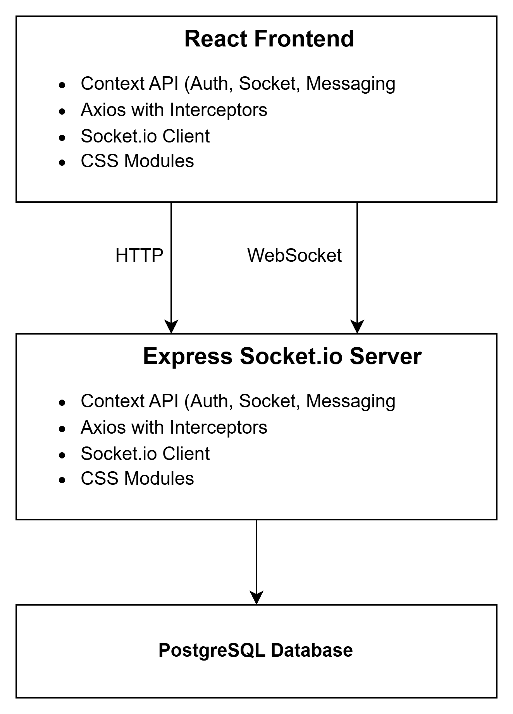
</div>

### Frontend Architecture

<div align="center">
  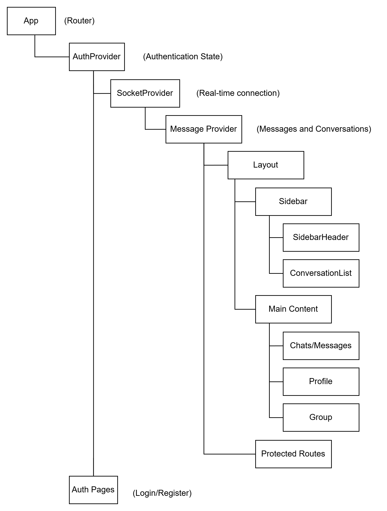
</div>

**State Management Strategy:**
- **Context API** for global state (no Redux needed)
- **Custom hooks** for reusable logic (`useAuth`, `useMessaging`, `useSocket`)
- **Axios interceptors** for automatic token refresh

## 🚀 Live Demo

**Check it out here:** [Cosyz](https://merry-heliotrope-1ee7ba.netlify.app/)

> **Note:** The app might be slow at first. Free hosting takes time to start up (Render).

### What you can try
- Send messages in real-time
- Make group chats
- Share files and images
- Edit your profile
- See who's online

## 🛠️ Getting Started

### Prerequisites
- Node.js (v18 or higher)
- npm or yarn
- Backend server running ([setup instructions](https://github.com/truongdodan/messaging_app-server))

### Installation

1. **Clone the repository**
   ```bash
   git clone https://github.com/truongdodan/messaging_app-client.git
   cd messaging_app-client
   ```

2. **Install dependencies**
   ```bash
   npm install
   ```

3. **Set up environment variables**

   Create a `.env` file in the root directory:
   ```env
   VITE_API_URL=http://localhost:5000
   VITE_SOCKET_URL=http://localhost:5000
   ```

4. **Start the backend server first**

   Follow setup instructions in the [backend repository](https://github.com/truongdodan/messaging_app-server)

5. **Run the development server**
   ```bash
   npm run dev
   ```

6. **Access the application**

   Open http://localhost:5173 in your browser

### Build for Production

```bash
# Build the app
npm run build

# Preview production build
npm run preview
```

### Testing

```bash
# Run tests
npm test

# Run Storybook for component testing
npm run storybook
```

## 📁 Project Structure

<!--  -->
<!--  -->
<div align="center">
  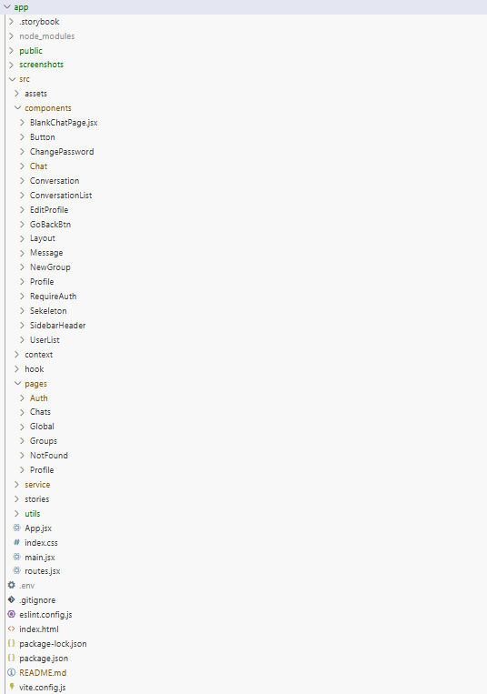
</div>

## 🔑 Key Frontend Features

### 1. Authentication Flow
- JWT-based authentication with httpOnly cookies
- Automatic token refresh using Axios interceptors
- Seamless re-authentication on token expiry
- Protected routes with authentication check

### 2. Real-time State Management
- Socket.io client integration
- Event-driven updates for messages and presence
- Automatic reconnection handling
- Room-based conversation management

### 3. Message Display
- Date-based message grouping (Today, Yesterday, This Week, etc.)
- Smooth auto-scroll to latest messages
- File preview with image support
- Message sender identification

### 4. State Synchronization
- REST API for initial data loading
- Socket.io for real-time updates
- Context API to share state across components
- Optimistic UI updates

## 📸 Screenshots

### Main Chat Interface
<!--  -->
<!--  -->
<!--  -->
<!--  -->
<!--  -->
<div align="center">
   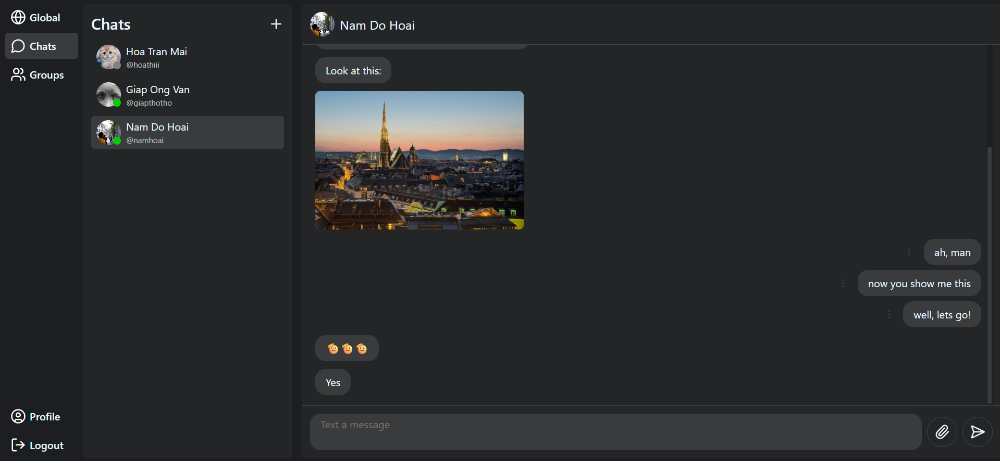
</div>
<br>
<div align="center">
   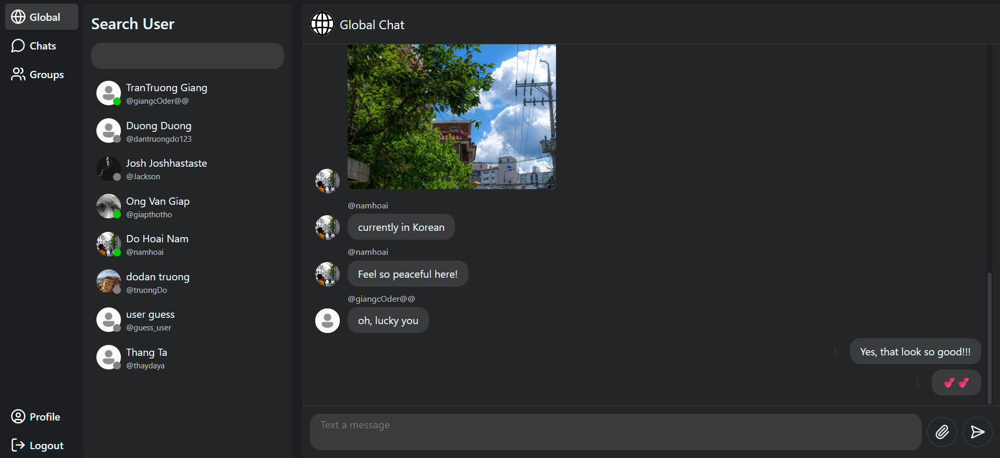
</div>
<br>
<div align="center">
   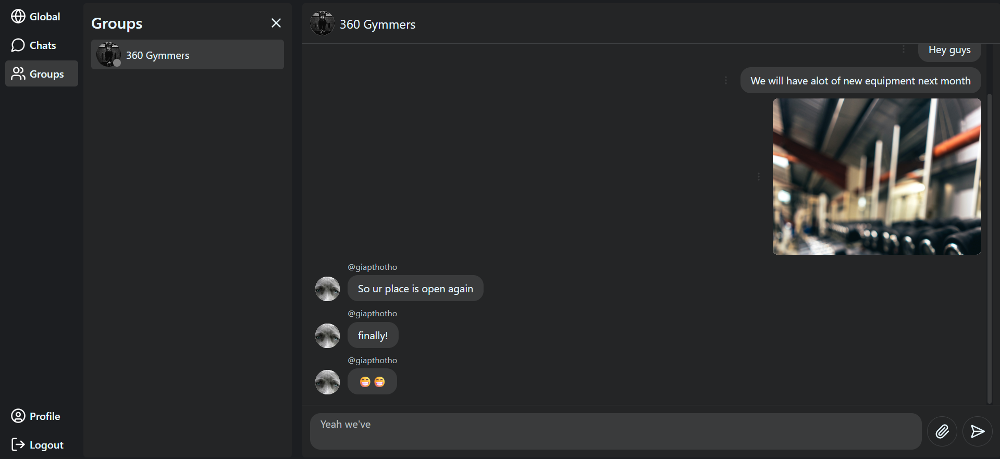
</div>
<div align="center">
   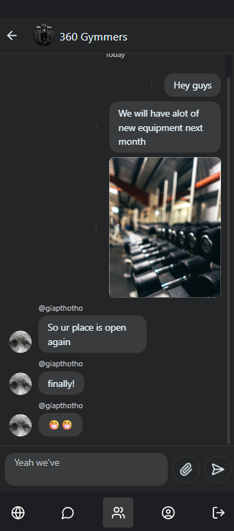
   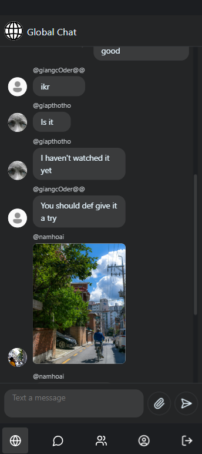
</div>

### User Features
<!-- 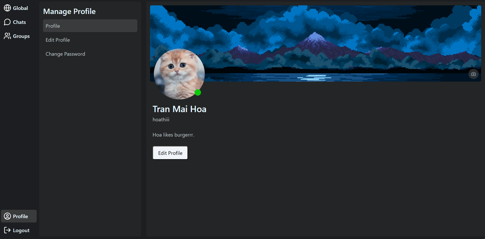 -->
<!-- 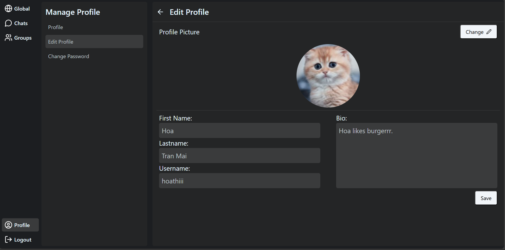 -->
<!--  -->
<!-- 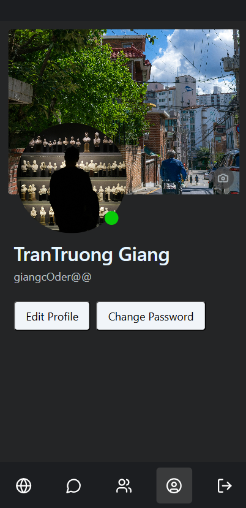 -->
<div align="center">
   
</div>
<br>
<div align="center">
   
</div>
<br>
<div align="center">
   
</div>

## 💡 What I Learned

Building this project helped me learn:

### Technical Skills
- **React Context API** - How to manage global state without Redux
- **Custom Hooks** - Making reusable code for auth, socket, and messaging
- **Axios Interceptors** - Auto token refresh when it expires
- **Socket.io Client** - Handling real-time events and connections
- **React Router** - Protected routes (login required pages)
- **State Management** - Using both REST API and WebSocket together

### Best Practices
- Breaking code into smaller components
- Keeping services, contexts, and components separate
- Consistent error message handling
- Making responsive design with CSS
- Preventing unnecessary re-renders

### Problems I Solved
- Syncing data between REST API and Socket.io
- Fixing infinite loops in token refresh
- Reconnecting WebSocket when connection drops
- Handling file uploads to cloud

## 🔮 Future Improvements

### Features
- [ ] Message read receipts
- [ ] Typing indicators
- [ ] Message editing and reactions
<!-- - [ ] Search messages functionality -->
- [ ] Light mode
- [ ] Push notifications
- [ ] Emoji picker

### Performance
- [ ] Message virtualization for large conversations
- [ ] Image lazy loading and optimization
- [ ] Code splitting for faster initial load
- [ ] Service Worker for offline support

### Testing
- [ ] Increase test coverage
- [ ] E2E tests with Playwright
- [ ] Component tests with Vitest
- [ ] Accessibility testing

## 🔗 Related Repositories

- **Backend API:** [messaging-app-server](https://github.com/truongdodan/YOUR-BACKEND-REPO-NAME)


---

**Note:** This is the frontend repository. For backend setup and API documentation, see the [backend repository](https://github.com/truongdodan/YOUR-BACKEND-REPO-NAME).
